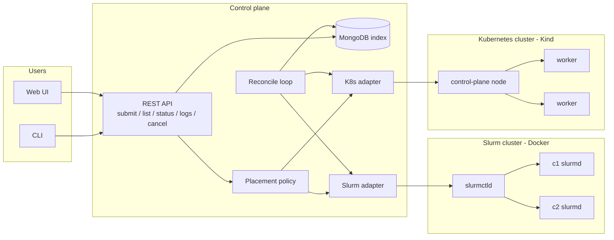
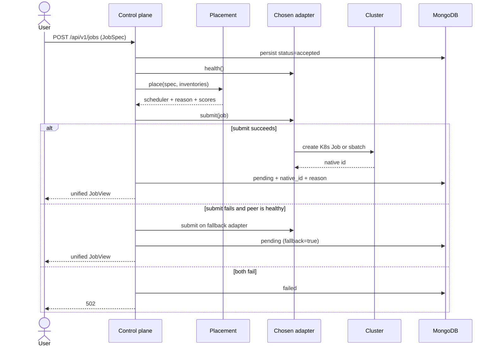
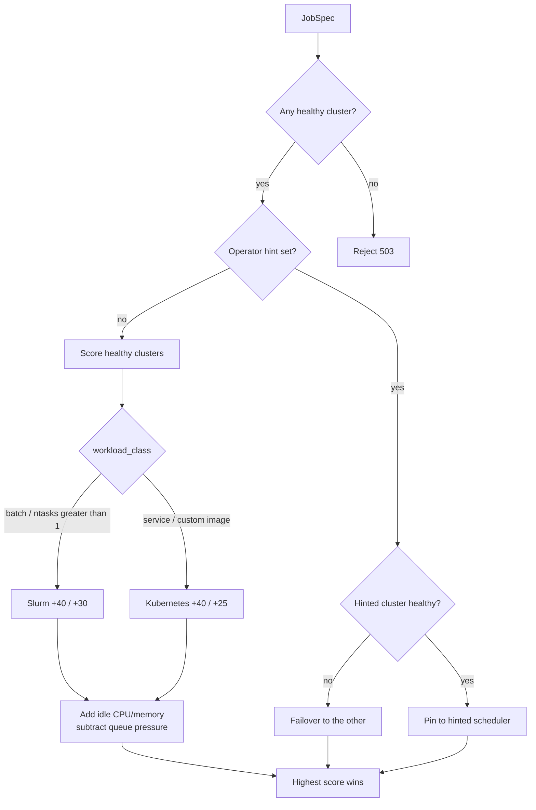
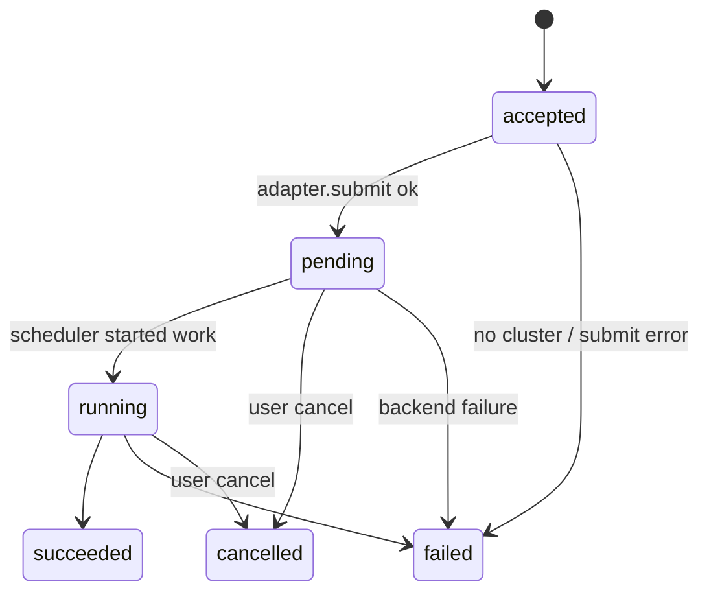
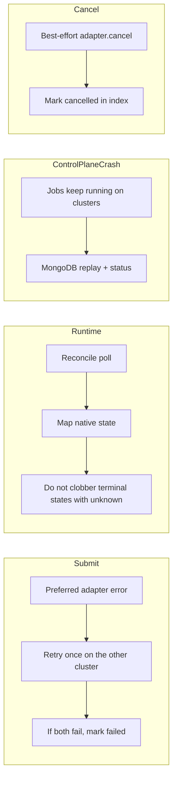
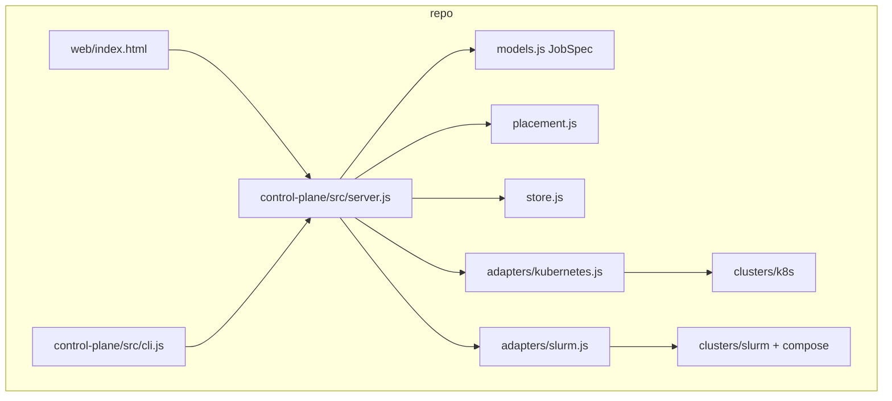

# Architecture

Use these diagrams at the start of the interview. Speak the first one for 60 seconds, then walk a submit through the sequence diagram.

---

## 1. System context — start here

Talk track: *“Two independent clusters. One control plane. Adapters hide kubectl and sbatch. Placement picks a backend from the workload shape and live capacity. Reconcile keeps our index honest.”*

---

## 2. Submit sequence

---

## 3. Placement policy

Scoring is deliberate and explainable. The API stores the reason string on the job so the demo UI can show *why* a job landed on Slurm or Kubernetes.

| Signal | Effect |
|---|---|
| `workload_class=batch` | Slurm +40 |
| `workload_class=service` | Kubernetes +40 |
| Non-default container image | Kubernetes +25 |
| `ntasks > 1` | Slurm +30 |
| Enough idle CPU / memory | +15 / +10 |
| Running+pending pressure | up to -20 |
| `scheduler_hint` | pin, with failover if unhealthy |

---

## 4. Status model

Both backends are mapped into one enum. That is the abstraction.

| Unified | Kubernetes | Slurm |
|---|---|---|
| pending | Job created, no active pod | PENDING / CONFIGURING |
| running | `active > 0` | RUNNING / COMPLETING |
| succeeded | `succeeded > 0` | COMPLETED |
| failed | `failed > 0` | FAILED / TIMEOUT / OOM |
| cancelled | Job deleted | CANCELLED / scancel |

---

## 5. Failure handling

---

## 6. Component view of the repo

