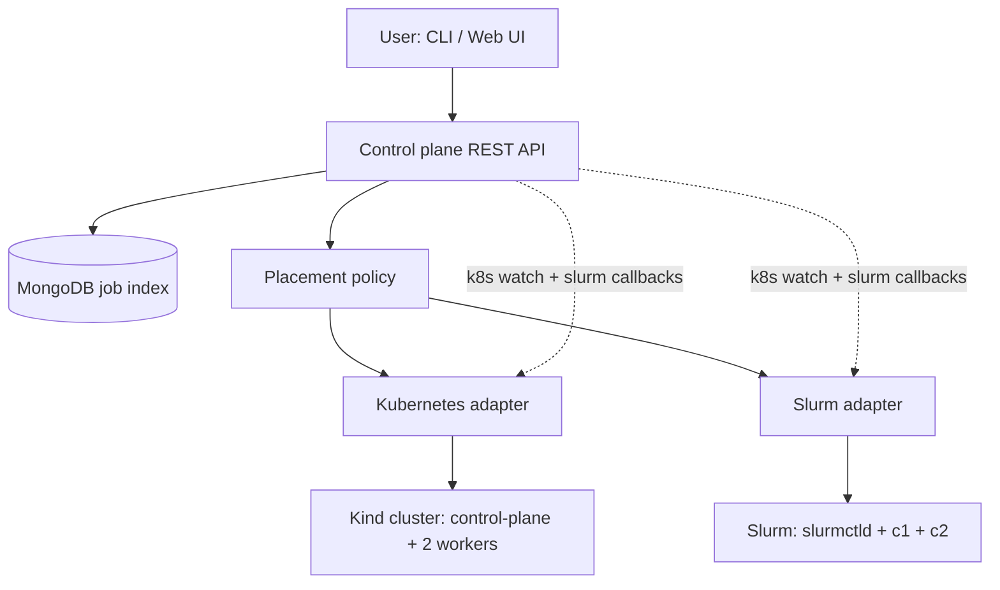

# Hybrid Compute Platform

Unified submit / monitor / cancel for workloads that run on **either Kubernetes or Slurm**. The user never names the scheduler. The control plane does.

This repository is a one-week interview assignment you can run on a laptop: a real Kind Kubernetes cluster, a real 3-container Slurm cluster, and a small control plane that sits in front of both.

---

## What the assignment actually asks for

The interviewer is not asking you to become a Kubernetes or Slurm expert. They are asking you to build a **scheduler-agnostic compute platform**.

| They said | What it means |
|---|---|
| Hybrid compute platform | Two different execution backends, one product surface |
| Integrate Kubernetes and Slurm | Keep the clusters **separate**. Do not turn one into the other |
| Unified interface | Same YAML / API / UI for submit, status, logs, cancel |
| Abstract the underlying scheduler | The user submits a *workload*, not a `kubectl` job or an `sbatch` script |
| Demonstrate + explain | Architecture, resource management, failure handling, design decisions, production gaps |
| Laptop with both clusters and individual nodes | Kind (control-plane + workers) and Slurm (controller + two compute nodes) |

**Out of scope (and you should say so):** identity, multi-tenancy, GPU scheduling, shared filesystem, billing. Those belong in “what I would change for production.”

---

## Solution flow (how to build it, in order)

1. **Stand up two real clusters, separately**
   - Kubernetes: Kind cluster `hcp` with 1 control-plane node + 2 workers.
   - Slurm: Docker Compose with `slurmctld` + compute nodes `c1` and `c2`.
2. **Define one job spec** that is not K8s YAML and not a Slurm batch script: name, command, image, CPU/memory, workload class.
3. **Write two adapters** behind the same interface: `submit`, `status`, `cancel`, `logs`, `health`.
4. **Write a placement policy** that scores both clusters (batch vs service, container image, parallel tasks, live capacity, health). Optional `scheduler_hint` is an operator escape hatch, not a user field.
5. **Persist jobs in MongoDB** (nested documents, including `resources`) and keep status **event-driven** (K8s watch + Slurm callbacks) so the control plane is not the source of truth.
6. **Expose one API / CLI / UI**. Demo two jobs that look identical to the user and land on different schedulers.
7. **Prepare the interview**: architecture diagram, why you routed the way you did, failure cases, what is demo-grade vs production-grade.

```text
User  ->  CLI / Web / REST
              |
        Control plane (Node.js / Express)
              |  unified JobSpec
        Placement policy
         /              \
   K8s adapter      Slurm adapter
        |                 |
   Kind cluster      slurmctld + c1 + c2
```

---

## Quick start

Prerequisites: Docker Desktop **running**, Node.js 18+, about 8 GB RAM. Kubernetes also needs [kind](https://kind.sigs.k8s.io/) (kubectl often ships with Docker Desktop).

On this Windows laptop:

1. Start **Docker Desktop** and wait until `docker info` works.
2. Install kind if you do not have it:

```bash
curl.exe -Lo kind.exe https://kind.sigs.k8s.io/dl/v0.27.0/kind-windows-amd64
mkdir -p "$HOME/bin"
mv kind.exe "$HOME/bin/kind.exe"
export PATH="$HOME/bin:$PATH"
kind version
```

Then:

MongoDB is the job index (database `hcp`, collection `jobs`). Nested `spec.resources` is stored as an object. Open it in Compass:

```
mongodb://127.0.0.1:27017
```

From Windows to the WSL demo, use the WSL IP instead of localhost (for example `mongodb://172.28.204.225:27017`). No username/password in this laptop setup.

```bash
# 1. clusters
bash scripts/setup.sh

# 2. control plane
bash scripts/run-api.sh

# 3. in another terminal
bash scripts/demo.sh
```

Open [http://127.0.0.1:8080](http://127.0.0.1:8080).

CLI:

```bash
node control-plane/src/cli.js clusters
node control-plane/src/cli.js submit examples/slurm-batch-hello.yaml
node control-plane/src/cli.js submit examples/k8s-python-pi.yaml
node control-plane/src/cli.js list
node control-plane/src/cli.js status <id>
node control-plane/src/cli.js logs <id>
node control-plane/src/cli.js cancel <id>
```

Tear down:

```bash
bash scripts/teardown.sh
```

Placement unit tests (no clusters required):

```bash
cd control-plane
npm install
npm test
```

---

## Architecture

Full diagrams: [ARCHITECTURE.md](ARCHITECTURE.md). Interview script: [INTERVIEW.md](INTERVIEW.md).



---

## Design in one page

**Resource management.** Each adapter reports inventory (healthy, idle CPU, idle memory, running/pending). Placement scores healthy clusters that **can fit** the request. If both are healthy but at capacity, the job is **queued** in the control plane (`202` + `status=queued`) instead of rejected. When a cluster reports a job finished/failed/cancelled event, capacity is re-checked and the queue is drained — there is no standing idle-CPU poll loop.

**Failure handling.** If the preferred scheduler is down or `submit` throws, the control plane fails over once to the other scheduler. Cancel is best-effort on the backend, then marked cancelled in the index. Job status is **event-driven**: Kubernetes Watch on Jobs, Slurm job-script callbacks to `POST /api/v1/internal/events`. After a control-plane restart, a one-shot bootstrap refreshes active jobs; steady state does not poll.

**Source of truth.** Kubernetes Jobs and Slurm job IDs are authoritative. MongoDB is a cache/index so the UI can list work across both systems. That is the most important production-shaped decision in this demo.

**What the user does not see.** No `kubectl`, no `sbatch`, no partition names, no namespaces. Those leak in logs/native ids for operators, not in the submit path.
